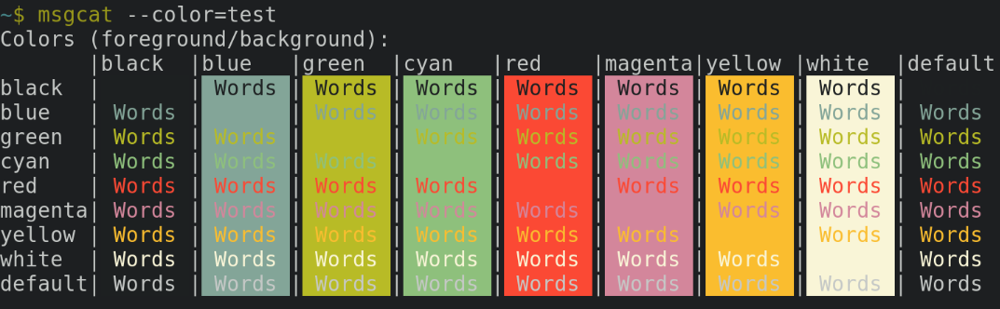

# Gruvbox zsh plugin

Zsh plugin that sets colors based on the [Gruvbox theme](https://github.com/morhetz/gruvbox) for vim.

Simply download (using your plugin manager or otherwise) and source the plugin to enable these colors.

## TODO

- [ ] Allow configuration for dark / light mode.
- [ ] Allow configuration for hard / soft mode.
